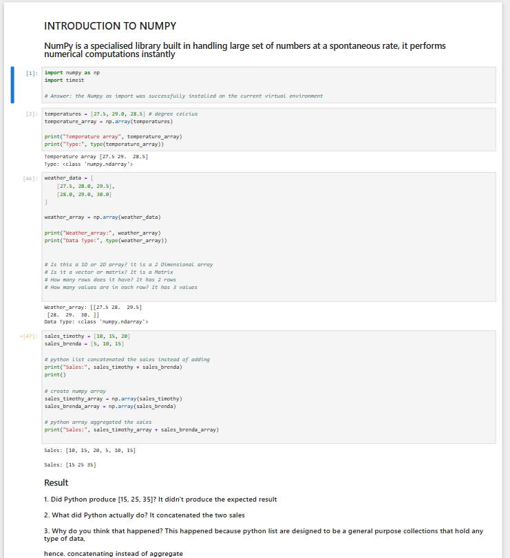
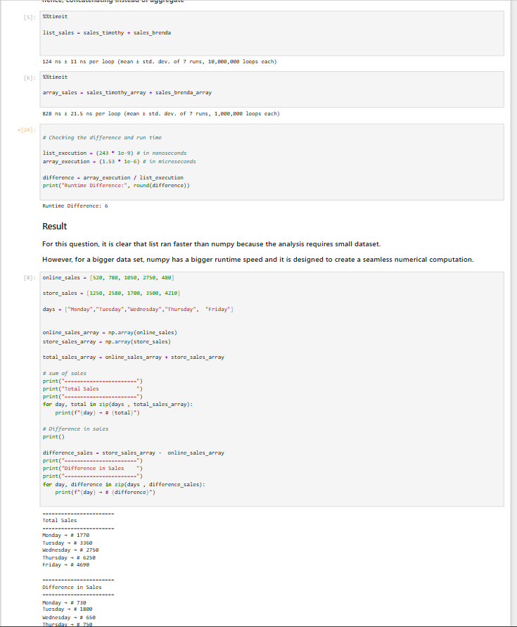
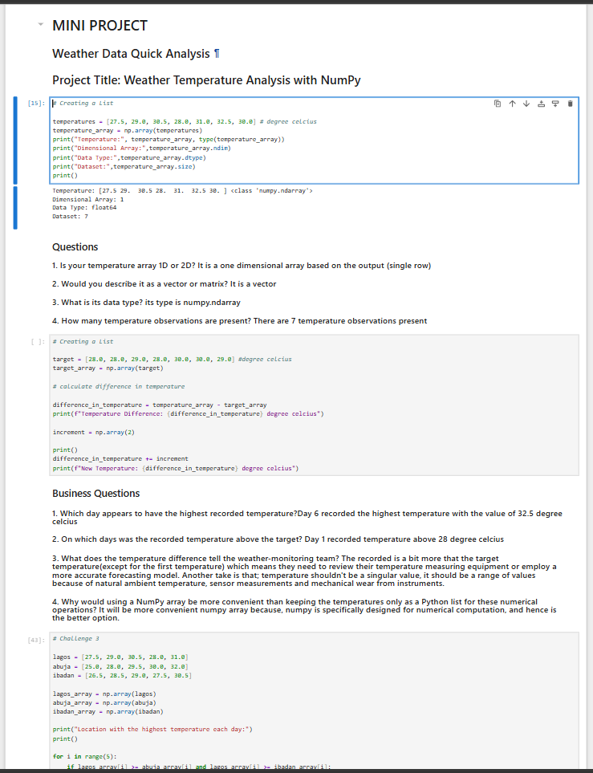
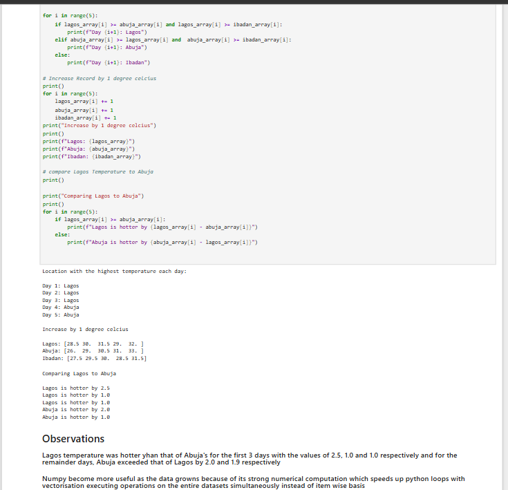
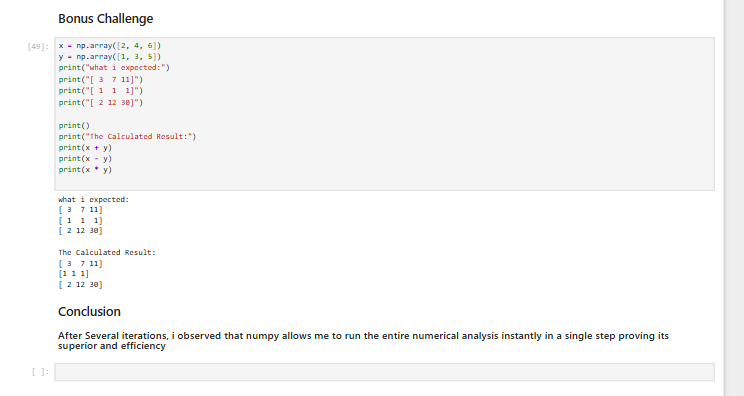

## 1. Introduction to NumPy
Handling large sets of numerical data efficiently is a fundamental requirement in modern data processing, scientific research, and environmental monitoring. Traditional Python collections, such as standard lists, are designed as general-purpose containers that handle heterogeneous data types, which can slow down large-scale mathematical computations. To overcome this limitation, specialized libraries like **NumPy (Numerical Python)** are utilized to perform high-speed vectorised numerical operations. This project approaches weather and temperature data analysis from a vectorized NumPy perspective, demonstrating how numerical computations can be executed instantaneously across multiple data points.

## 2. Problem Statement
When dealing with environmental monitoring, weather data—such as ambient temperatures across multiple regions (Lagos, Abuja, and Ibadan)—frequently requires intensive arithmetic processing, comparative evaluations, and performance benchmarking. Standard Python lists fail to aggregate elements natively during basic arithmetic operations (e.g., adding two lists concatenates them instead of summing their values element-wise). Furthermore, executing repetitive item-wise calculations using standard loops becomes computationally expensive as dataset sizes scale. Without vectorized data structures, analysts face performance bottlenecks and face difficulties in processing quick multi-location weather evaluations.

## 3. Solution
To address these challenges, we built a comprehensive, NumPy-powered analytical Python script. The system explores NumPy array initialization, evaluates multidimensional matrices, benchmarks runtime performance differences against standard lists, computes multi-location weather comparisons, and executes vectorized arithmetic operations (addition, subtraction, and multiplication) to streamline weather data analysis.

## 4. Importance of Problem
Optimizing numerical computations is vital for several technical and industry domains:
* **High-Speed Data Processing:** Essential for applications requiring rapid mathematical computations over large arrays of sensor or meteorological data.
* **Vectorized Efficiency:** Eliminates slow explicit Python loops by applying operations simultaneously across entire datasets.
* **Comparative Environmental Monitoring:** Enables seamless multi-city temperature tracking (Lagos, Abuja, Ibadan) to evaluate regional climate patterns and forecast discrepancies.
* **Equipment & Sensor Calibration:** Helps data teams identify deviations between target thresholds and recorded sensor values, accounting for natural ambient variations and instrument wear.

## 5. Features
* **NumPy Array Initialization & Exploration:** Constructs 1D vectors and 2D matrices while programmatically inspecting dimensions (`ndim`), data types (`dtype`), and total sizes (`size`).
* **Performance Benchmarking:** Utilizes `timeit` magic commands to compare execution speeds between standard Python list concatenation/addition and NumPy array operations.
* **Vectorized Arithmetic Calculations:** Performs element-wise additions, subtractions, and multiplications across weather observations and target thresholds instantly.
* **Multi-Location Weather Comparison:** Evaluates historical temperature trends across Lagos, Abuja, and Ibadan to determine peak temperature days and regional temperature differentials.
* **Bonus Element-Wise Validation:** Tests array operations against expected outcomes to confirm vectorization accuracy.

## 6. Python Concepts Used
* **Libraries:** `numpy` for high-performance numerical array processing and `timeit` for execution runtime benchmarking.
* **Data Structures:** NumPy ndarrays (`np.array`) for homogenous numerical storage and standard Python lists for initial staging.
* **Control Flow:** Conditional statement blocks (`if`/`elif`/`else`) paired with comparison operators to evaluate regional temperature peaks.
* **Iteration Logic:** `for` loops combined with `range()` and `zip()` functions to iterate through multi-city datasets.
* **Vectorization:** Leveraging NumPy's internal C-optimized architecture to execute operations across entire datasets simultaneously rather than element-by-element iteration.

## 7. Project Workflow
1. **Library Import & Verification:** Importing `numpy` and `timeit` to confirm proper virtual environment installation.
2. **Array Creation & Dimension Inspection:** Initializing temperature lists, converting them into NumPy arrays, and checking data types, dimensions, and element counts.
3. **Performance Benchmarking:** Running timing evaluations (`%%timeit`) to analyze runtime differences between standard Python lists and NumPy arrays.
4. **Comparative Analysis & Calculations:** Computing total sales, temperature differences against target baselines, and increments.
5. **Multi-Location Challenge Execution:** Analyzing multi-city data (Lagos, Abuja, Ibadan) to track daily peaks, apply uniform temperature increases, and cross-compare regional heat differentials.

## 8. Project Walkthrough
The analysis is structured across progressive code blocks and markdown sections within the Jupyter Notebook:
* **NumPy Introduction:** Establishes the core utility of NumPy in handling large numbers at spontaneous rates.
* **Array vs List Behavior:** Demonstrates how adding two standard lists (`sales_timothy + sales_brenda`) concatenates items into `[10, 15, 20, 5, 10, 15]`, whereas NumPy arrays correctly aggregate elements into `[15, 25, 35]`.
* **Runtime Benchmarking:** Compares execution speeds, noting that while small datasets may show close margins, NumPy's underlying architecture is specifically engineered to scale seamlessly for massive numerical datasets.
* **Mini-Project (Weather Data Quick Analysis):** Analyzes a 7-day temperature array (`[27.5, 29.0, 30.5, 28.0, 31.0, 32.5, 30.0]`), checking its 1D vector structure (`ndim = 1`), `float64` data type, and size (`7`).
* **Target Comparison & Increments:** Computes temperature differences against a baseline target array and applies scalar increments (`+= 2`).
* **Multi-Location Challenge (Lagos vs Abuja vs Ibadan):** Evaluates 5-day multi-city metrics, identifies daily peak locations using conditional loops, applies a uniform $+1^\circ\text{C}$ increase across all location arrays, and computes direct temperature differentials between Lagos and Abuja.
* **Bonus Vectorized Operations:** Validates element-wise addition, subtraction, and multiplication across arrays `x` and `y`.

## Program Screenshots

## 9. Result
* **Array Aggregation vs Concatenation:** Confirmed that standard Python lists perform general-purpose collection handling (concatenation), whereas NumPy arrays perform true mathematical aggregation.
* **Dimensional Inspection:** Verified that single-row weather records successfully initialize as 1-dimensional vectors (`ndim = 1`) with a `float64` data type.
* **Peak Temperature Identification:** Successfully isolated Day 6 as the highest recorded temperature period reaching **$32.5^\circ\text{C}$**.
* **Regional Differentials:** Mapped out multi-city variations, showing that Lagos temperatures exceeded Abuja during initial observation days before Abuja peaked in later cycles.
* **Vectorized Output Validation:** Successfully executed element-wise array calculations matching expected mathematical results across custom vectors `x` and `y`.

## 10. Summary Report Dashboard
The project concludes with structured observations and mini-project summaries highlighting:
* **Dataset Scope:** Analysis conducted across 7-day single-location logs and 5-day multi-location comparative arrays.
* **Computational Efficiency:** Demonstrated that NumPy eliminates the need for slow element-wise loops by executing batch mathematical transformations in a single step.
* **Data Integrity Insights:** Emphasized that environmental data should ideally be evaluated as ranges rather than rigid singular values to account for natural ambient fluctuations, sensor measurement tolerances, and mechanical instrument wear.

## 11. Key Findings (Using Code Numbers)
* **1-Dimensional Vector Profiling:** The primary temperature dataset evaluated contains exactly **7** observation elements structured as a 1D NumPy array (`ndim = 1`).
* **Multi-City Regional Spread:** Comparative evaluations tracked weather patterns across exactly **3** major cities (**Lagos**, **Abuja**, and **Ibadan**) over a **5**-day operational window.
* **Peak Temperature Value:** Day **6** recorded the absolute highest temperature value across the primary dataset at **$32.5^\circ\text{C}$**.
* **Scalar Increment Application:** Uniform environmental adjustments successfully applied a constant scalar increment of **$+1^\circ\text{C}$** across multi-city tracking arrays simultaneously via vectorized syntax.

## 12. Key Learnings
* **Understanding Vectorization:** Recognized that NumPy achieves massive speed improvements by executing operations on entire blocks of memory simultaneously via C-optimized code, bypassing slow Python interpreter loops.
* **List vs Array Behavioral Distinction:** Learned firsthand why attempting arithmetic on standard Python lists causes data concatenation instead of numerical addition, reinforcing the necessity of choosing specialized data structures for data science tasks.
* **Handling Real-World Sensor Data:** Gained appreciation for how data anomalies, sensor drift, and target baseline comparisons inform better environmental forecasting models.

## 13. Future Improvement
* **External File Integration:** Upgrading the script to load meteorological datasets from external CSV or Excel files using Pandas/NumPy integration rather than hardcoded lists.
* **Advanced Visualizations:** Integrating Matplotlib or Seaborn libraries to plot multi-city temperature trends and thermal variances over time.
* **Large-Scale Data Scaling:** Expanding performance benchmarking to arrays containing millions of elements to fully showcase NumPy's computational superiority over native Python structures.
